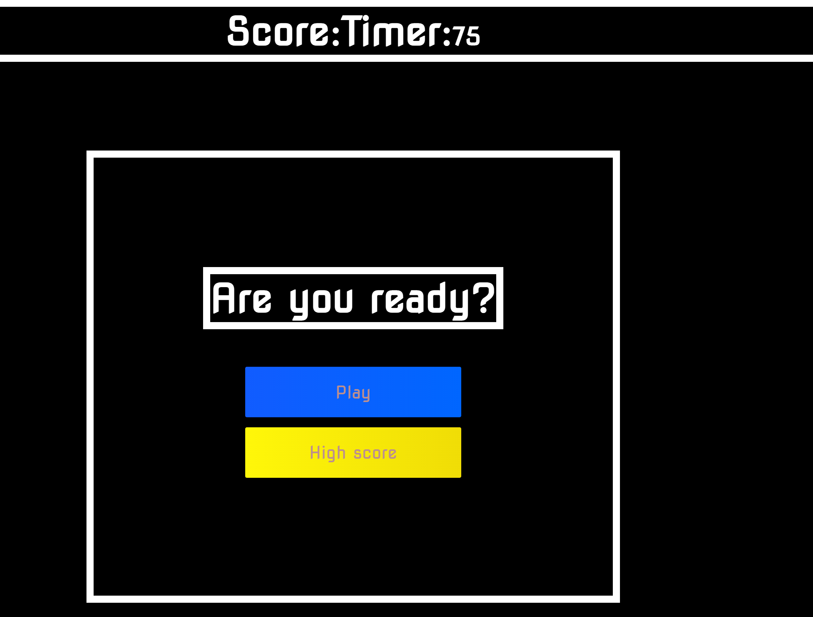
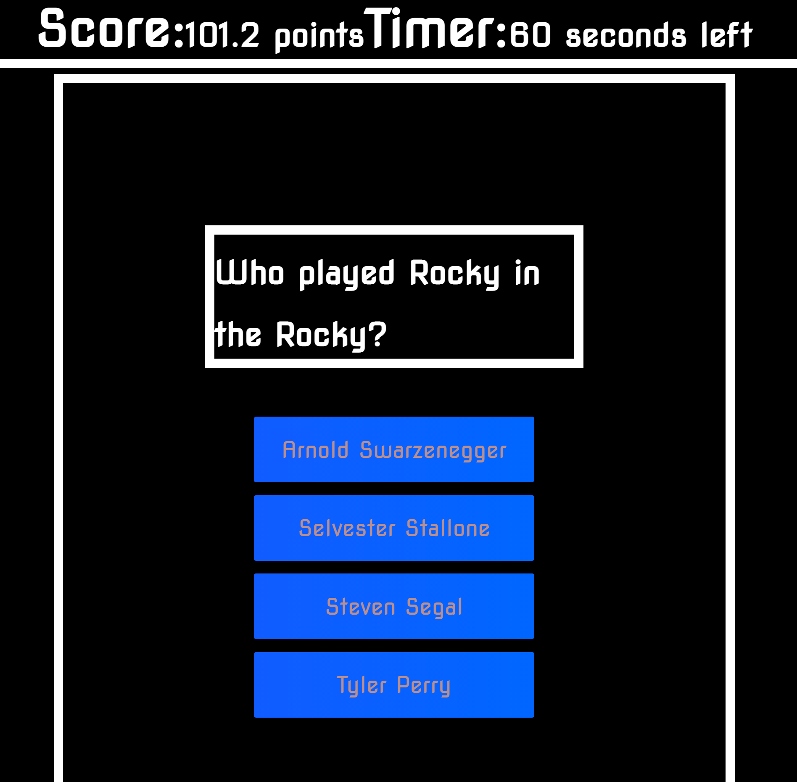
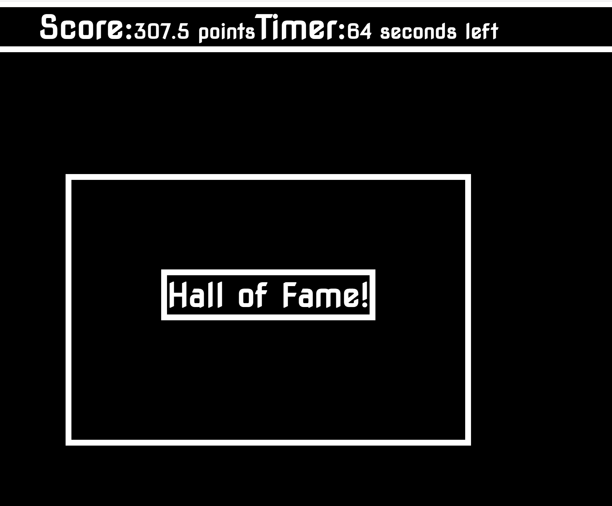

# hoefer-trivia-site
# Site Link
https://hoeferm2.github.io/hoefer-trivia-site/

# git-hub Repository Link
https://github.com/hoeferm2/hoefer-trivia-site/
## This weeks task
# 04 Web APIs: Code Quiz

## Your Task

For this modules assignment we were tasked with creating a trivia quiz through javascript. My quiz had Start button functionality along with a button to bring the user to the high score page.. A user score and timer were displayed on the top of the screen. 

User score would update on the clicking of the correct answer button. If users got the answer wrong they would lose 5 seconds on the timer. I was unable to implement local storage. So there is no high score function. Each of the four buttons was an independent link that texted textcontent of the button vs. the answer object in an array. Score was both a flat number as well as a time remaining multiplier. If user runs out of time the game will also end. 

## Graditude.
Thanks to all the slack assistants for working me through the button functions. Thanks to Henry and Lindsey for helping explain endgame conditions. 

